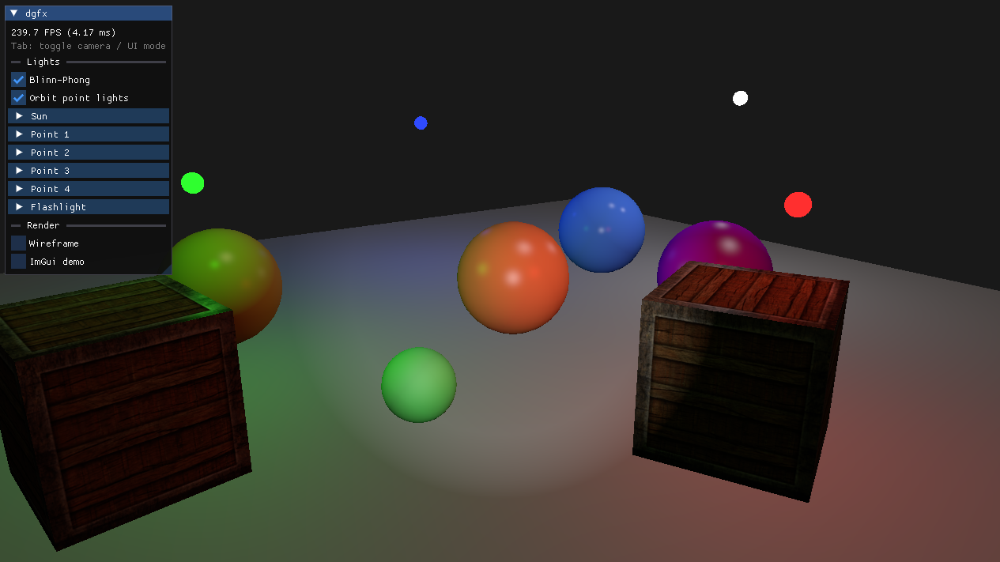

# dgfx



A game engine written in C++ as a learning project: the goal is to understand how game engines are designed and implemented by building one step by step, one feature at a time.

## Features

- **OpenGL 4.6 core** rendering on a GLFW window, with vsync and resize/minimize handling.
- **Shaders** loaded from files, compiled and linked, with error reporting and typed uniform setters.
- **Meshes** that own their GPU buffers (VAO/VBO/EBO), with procedural cube and UV sphere generation.
- **Textures** loaded with stb_image (PNG/JPG), sRGB or linear, mipmapped with anisotropic filtering, bound to multiple texture units.
- **3D transforms**: model/view/projection matrices, perspective projection, depth testing.
- **Fly camera**: mouse look, WASD movement, zoom, frame-rate independent speed.
- **Lighting**: Blinn-Phong with multiple lights at once: a directional sun, up to 4 point lights (distance attenuation) and a camera flashlight (spot with soft edges). Per-object materials: diffuse/specular colors and shininess, with optional lighting maps (diffuse + specular textures) for per-pixel materials. Directional shadow mapping for the sun. Gamma-correct: lighting is computed in linear space (sRGB textures and framebuffer).
- **Post-processing**: the scene renders to an off-screen framebuffer, then a full-screen pass applies effects (grayscale, invert, blur, sharpen, edge detection) and a user gamma adjustment.
- **Debug UI** with Dear ImGui: a live panel to tweak lights, rendering and display settings, with an FPS counter.

## Controls

| Input | Action |
|---|---|
| Mouse | Look around |
| W / A / S / D | Move forward / left / back / right |
| Space / Left Ctrl | Move up / down |
| Left Shift | Move faster |
| Scroll wheel | Zoom |
| Tab | Toggle camera mode (cursor captured) / UI mode (cursor free, to use the panel) |
| Click outside the panel | Back to camera mode (the cursor is also released when the window loses focus) |
| Esc | Quit |

## External libraries

- [GLFW](https://www.glfw.org/): cross-platform window creation, OpenGL context and input handling.
- [GLAD](https://github.com/Dav1dde/glad): OpenGL function loader (OpenGL 4.6 core), generated with the [GLAD web generator](https://glad.dav1d.de/).
- [stb_image](https://github.com/nothings/stb): single-header image loader (PNG, JPG, ...) used to load textures.
- [GLM](https://github.com/g-truc/glm): header-only math library for vectors, matrices and transformations.
- [Dear ImGui](https://github.com/ocornut/imgui): immediate-mode UI for the debug panel (GLFW + OpenGL 3 backends).

## Building

Requires CMake 3.20+ and a C++20 compiler.

```
cmake -S . -B build
cmake --build build --config Debug
```
