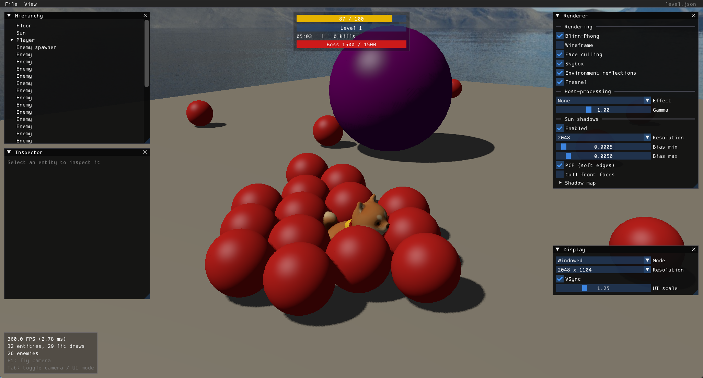

# dgfx



dgfx is a C++20 / OpenGL 4.6 game engine written as a learning project, together with a game built on top. The goal is to understand how game engines are designed and implemented by building one step by step.

## Game

A simplified 3D survivors-like built on the engine.

- **Player**: runs relative to the camera, turns to face where it's going, and jumps with gravity.
- **Enemies**: spawn on a ring around the player, chase it and drain its health on contact. They collide: they push each other apart, they cannot overlap the player, and everyone stays inside the arena.
- **Automatic weapon**: shoots projectiles at the nearest enemy in range. Enemies have health and are destroyed at zero; the stats overlay counts kills.
- **Experience**: dead enemies drop XP orbs. Orbs near the player fly to it and raise its level. At each level-up the game pauses and offers 3 random upgrades (damage, fire rate, move speed, pickup radius, max health).
- **Game flow**: a main menu, a HUD (health, XP and level, time, kills), pause and game over with the run stats, and restart.
- **Third-person camera**: orbits the player, with adjustable distance.

## Engine features

### Rendering

- **OpenGL 4.6 core** on a GLFW window, with vsync and resize/minimize handling.
- **Shaders** loaded from files, compiled and linked, with error reporting and typed uniform setters.
- **Meshes** that own their GPU buffers (VAO/VBO/EBO), with procedural cube and UV sphere generation.
- **Textures** loaded with stb_image (PNG/JPG), sRGB or linear, mipmapped with anisotropic filtering, bound to multiple texture units.
- **3D transforms**: model/view/projection matrices, perspective projection, depth testing, back-face culling.
- **Lighting**: Blinn-Phong, computed in linear space (sRGB textures and framebuffer, so it is gamma-correct).
  - Several lights at once: a directional sun, up to 4 point lights (distance attenuation) and a camera flashlight (spot with soft edges).
  - Per-object materials: diffuse/specular colors and shininess, with optional lighting maps (diffuse + specular textures) for per-pixel detail.
  - Environment reflections and refraction from the skybox, with Fresnel.
  - Directional shadow mapping for the sun.
- **Skybox**: cubemap environment rendered behind the scene (depth at the far plane, camera translation removed).
- **Post-processing**: the scene renders to an off-screen framebuffer, then a full-screen pass applies effects (grayscale, invert, blur, sharpen, edge detection) and a user gamma adjustment.

### Scene and assets

- **Model loading** with Assimp (glTF, OBJ): meshes and their materials (diffuse/specular textures, double-sided surfaces).
- **Asset manager** that loads meshes, textures, models and skyboxes on first use and shares them.
- **Entities and components** with EnTT, with a parent/child transform hierarchy.
- **Scene files**: scenes are JSON, loaded and saved through a component registry, so the engine never names game components (see [Editing scenes](#editing-scenes)).

### Tools

- **Debug UI** with Dear ImGui: separate panels for the scene hierarchy, the selected entity's components, and rendering and display settings, plus a stats overlay.
- **Scene editing** from the UI: add, duplicate and delete entities, add and remove components, save.
- **Debug fly camera** (F1): mouse look, WASD movement, zoom, frame-rate independent speed.

## Controls

| Input | Action |
|---|---|
| Mouse | Orbit the camera |
| W / A / S / D | Run forward / left / back / right |
| Space | Jump |
| Scroll wheel | Camera distance |
| F1 | Toggle the debug fly camera |
| Esc | Pause / resume |
| Enter | Start, resume or restart on the menus |
| 1 / 2 / 3 | Pick a level-up upgrade |
| Tab | Toggle captured mode (cursor hidden) / UI mode (cursor free, to use the panels) |
| Click outside the panels | Back to captured mode (the cursor is also released when the window loses focus) |

Fly camera: mouse to look, W / A / S / D to move, Space / Left Ctrl up / down, Left Shift faster, scroll wheel to zoom.

The **File** menu has **Open scene** (it lists the files in `scenes/`), **Save scene** and **Exit**. Closing the window also quits. A scene with a player entity is played; any other scene, like the demo, is explored with the fly camera.

## Editing scenes

Scenes live in `scenes/` as JSON: `level.json` is the game level and `demo.json` is the engine demo. In UI mode (Tab):

- **Hierarchy**: right-click an entity for Add child, Duplicate and Delete (deleting also removes its children). Right-click empty space for Add entity.
- **Inspector**: edit the name, transform and components. Use the X on a component to remove it, and "Add component" to add one.
- **File → Save scene** writes the loaded scene file. Entities spawned while playing (enemies) are not saved.

A scene file is a list of entities. A component is a key named after its inspector section, and `parent` is the index of another entity in the list:

```json
{
  "sky": "skybox/",
  "entities": [
    {
      "name": "Crate",
      "transform": { "position": [3, -0.5, 2], "rotation": [0, 20, 0], "scale": [1, 1, 1] },
      "Mesh renderer": { "mesh": "cube", "material": { "diffuse": [0.5, 0.3, 0.1] } }
    }
  ]
}
```

Scenes are read when the app starts and whenever you open one from **File → Open scene** (opening the current one again reloads it), so after editing a file by hand, open it again to see the change.

## External libraries

- [GLFW](https://www.glfw.org/): cross-platform window creation, OpenGL context and input handling.
- [GLAD](https://github.com/Dav1dde/glad): OpenGL function loader (OpenGL 4.6 core), generated with the [GLAD web generator](https://glad.dav1d.de/).
- [stb_image](https://github.com/nothings/stb): single-header image loader (PNG, JPG, ...) used to load textures.
- [GLM](https://github.com/g-truc/glm): header-only math library for vectors, matrices and transformations.
- [Dear ImGui](https://github.com/ocornut/imgui): immediate-mode UI for the debug panels (GLFW + OpenGL 3 backends).
- [Assimp](https://github.com/assimp/assimp): 3D model importer (glTF and OBJ importers enabled).
- [EnTT](https://github.com/skypjack/entt): header-only entity component system.
- [nlohmann/json](https://github.com/nlohmann/json): JSON for scene files.

## Project layout

- `src/engine/`: the engine, built as a static library (`dgfx_engine`) that knows nothing about any game: `core/` (window, application loop, input, camera), `renderer/`, `assets/`, `scene/` (entities, components, scene files) and `ui/`.
- `src/game/`: the game (`dgfx`), an executable on top of the engine. It derives from `Application`, registers its own components and loads its scenes.
- `scenes/`: the scene files.
- `shaders/`, `textures/`, `models/`: assets, loaded from here at runtime.

## Building

Requires CMake 3.20+, a C++20 compiler and a GPU with OpenGL 4.6. Developed and tested on Windows with MSVC. The first configure downloads and builds the dependencies, so it needs an internet connection and takes a few minutes (Assimp is the slow one).

```
cmake -S . -B build
cmake --build build --config Debug
```

Run `build/Debug/dgfx.exe`. Shaders, textures, models and scenes are read from the source tree by absolute path, so it runs from any working directory, but only while the repository stays where it was built. In Visual Studio, open the folder (it's a CMake project) and run `dgfx.exe`.

## License

MIT, see [LICENSE](LICENSE).

## Credits

- "Shiba" (https://sketchfab.com/3d-models/shiba-faef9fe5ace445e7b2989d1c1ece361c) by zixisun02 (https://sketchfab.com/zixisun51), licensed under CC-BY-4.0 (http://creativecommons.org/licenses/by/4.0/).
